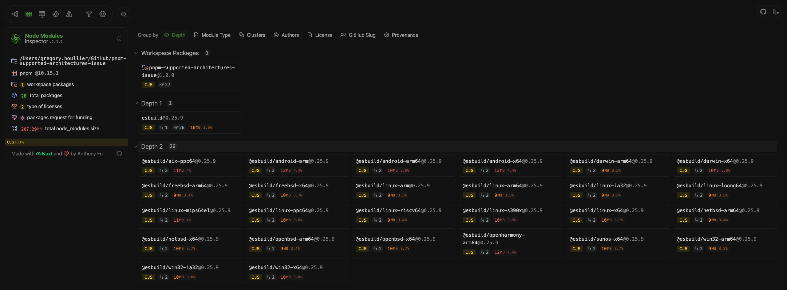

# pnpm-supported-architectures-issue

> This repository demonstrates an issue with pnpm's supported architectures.

## Expected Behavior

According to the [pnpm documentation](https://pnpm.io/settings#supportedarchitectures) and given the configuration in `pnpm-workspace.yaml`

```yaml
onlyBuiltDependencies:
  - esbuild

supportedArchitectures:
  cpu: [arm64]
  os: [linux]
```

`pnpm` should only install the following architectures:

- Linux arm64

## Actual Behavior

pnpm install all the optional dependencies defined in `esbuild`

```json
{
  "optionalDependencies": {
    "@esbuild/aix-ppc64": "0.25.9",
    "@esbuild/android-arm": "0.25.9",
    "@esbuild/android-arm64": "0.25.9",
    "@esbuild/android-x64": "0.25.9",
    "@esbuild/darwin-arm64": "0.25.9",
    "@esbuild/darwin-x64": "0.25.9",
    "@esbuild/freebsd-arm64": "0.25.9",
    "@esbuild/freebsd-x64": "0.25.9",
    "@esbuild/linux-arm": "0.25.9",
    "@esbuild/linux-arm64": "0.25.9",
    "@esbuild/linux-ia32": "0.25.9",
    "@esbuild/linux-loong64": "0.25.9",
    "@esbuild/linux-mips64el": "0.25.9",
    "@esbuild/linux-ppc64": "0.25.9",
    "@esbuild/linux-riscv64": "0.25.9",
    "@esbuild/linux-s390x": "0.25.9",
    "@esbuild/linux-x64": "0.25.9",
    "@esbuild/netbsd-arm64": "0.25.9",
    "@esbuild/netbsd-x64": "0.25.9",
    "@esbuild/openbsd-arm64": "0.25.9",
    "@esbuild/openbsd-x64": "0.25.9",
    "@esbuild/openharmony-arm64": "0.25.9",
    "@esbuild/sunos-x64": "0.25.9",
    "@esbuild/win32-arm64": "0.25.9",
    "@esbuild/win32-ia32": "0.25.9",
    "@esbuild/win32-x64": "0.25.9"
  }
}
```

### `node-module-inspector` screenshot


